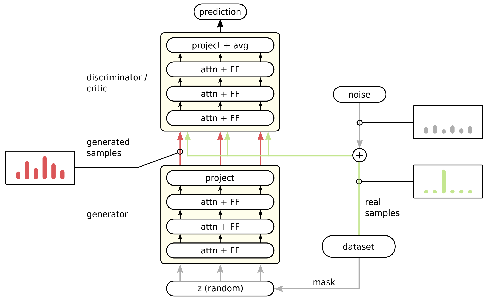

Generating Symbolic Reasoning Problems with Transformer GANs
============================================================

This is the implementation of the paper [Generating Symbolic Reasoning Problems with Transformer GANs](https://arxiv.org/abs/2110.10054).

Constructing training data for symbolic reasoning domains is challenging: On the one hand existing instances are typically hand-crafted and too few to be trained on directly, on the other hand synthetically generated instances are often hard to evaluate in terms of their meaningfulness.

We provide a GAN and a Wasserstein GAN equipped with Transformer encoders to generate sensible and challenging training data for symbolic reasoning domains.
Even without autoregression, the GAN models produce syntactically correct problem instances.
The generated data can be used as a substitute for real training data, and, especially, the training data can be generated from a real data set that is too small to be trained on directly.

For example, the models produced the following correct mathematical expressions:

    

and the following correct Linear-time Temporal Logic (LTL) formulas used in verification:

## Installation
The code is shipped as a Python package that can be installed by executing

    pip install -e .

in the `impl` directory (where `setup.py` is located). Python version 3.6 or higher is required.
Additional dependencies such as `tensorflow` will be installed automatically.
To generate datasets or solve instances immediately after generation, the LTL satisfiability checking tool `aalta` is required as binary.
It can be obtained from [bitbucket](https://bitbucket.org/jl86/aalta) (earliest commit in that repository).
After compiling, ensure that the binary `aalta` resides under the `bin` folder.

## Datasets

A zip file containing our original datasets can be downloaded from [here](https://storage.googleapis.com/tgan-sr/datasets.zip).
Unpack its contents to the `datasets` directory.

## Dataset generation

Alternatively, datasets can be generated from scratch.
The following procedure describes how to construct a dataset similar to the main base dataset (LTLbase):

First, generate a raw dataset by

    python -m tgan_sr.data_generation.generator -od datasets/LTLbase --splits all_raw:1 --timeout 2 -nv 10 -ne 1600000 -ts 50 --log-each-x-percent 1 --frac-unsat None

(possibly rename to not override the supplied dataset). Enter the newly created directory.

Optional: Visualize the dataset (like Figures 5 and 6 in the paper)

    python -m tgan_sr.utils.analyze_dataset all_raw.txt formula,sat

To filter the dataset for duplicates and balance classes per size

    python -m tgan_sr.utils.update_dataset all_raw.txt unique - | python -m tgan_sr.utils.update_dataset - balance_per_size all_balanced.txt

Optional: Calculate relaxed satisfiability

    python -m tgan_sr.utils.update_dataset all_balanced.txt relaxed_sat all_balanced_rs.txt

Optional: Visualize the dataset (like Figures 7 and 8 in the paper)

    python -m tgan_sr.utils.analyze_dataset all_balanced_rs.txt formula,sat+relaxed

Split the data into training and validation sets

    python -m tgan_sr.utils.update_dataset all_balanced_rs.txt shuffle+split=train:8,val:1,test:1

## Experiments (training)

The folder `configs` contains JSON files for each type of experiment in the paper. Settings for different hyperparameters can be easily adjusted.

A model can be trained like this:

    python -m tgan_sr.train.gan --run-name NAME --params-file configs/CONFIG.json

During training, relevant metrics will be logged to `train_custom` in the run's directory and can be viewed with tensorboard afterwards.

A list of all configurations and corresponding JSON files:

* Standard WGAN: `wgan_gp10_nl6-4_nc2_bs1024.json`
* Standard GAN: `gan_nl6-4_nc2_bs1024.json`
* different σ for added noise: add parameter "gan_sigma_real" and assign desired value
* WGAN on 10K-sized base dataset: `n10k_wgan_gp10_nl6-4_nc2_bs512.json`
* Sample data from the trained WGAN: `sample_n10k_wgan_gp10_nl6-4_nc2_bs512.json` (ensure the "load_from" field matches your trained run name)
* Classifier on default dataset: `class_nl4_bs1024.json` 
* Classifier on generated dataset: `class_Generated_nl4_bs1024.json` 
* WGAN with included classifier: `wgan+class_nl6-3s1_nc2_bs1024.json` 
* WGAN with absolute uncertainty objective: `wgan+class+uncert-abs_nl6-3s1_nc2_bs1024.json` (ensure the "looad_from" field matches your pre-trained name)
* WGAN with entropy uncertainty objective: `wgan+class+uncert-entr_nl6-3s1_nc2_bs1024.json` (ensure the "looad_from" field matches your pre-trained name)
* Sample data from the trained WGAN with entropy uncertainty objective: `sample_wgan+class+uncert-entr_nl6-3s1_nc2_bs1024.json` (ensure the "load_from" field matches your trained run name)

## Evaluation

To test a trained classifier on an arbitrary dataset (validation):

    python -m tgan_sr.train.gan --run-name NAME --test --ds-name DATASET_NAME

The model will be automatically loaded from the latest checkpoint in the run's directory.

## How to Cite

    @article{TGAN-SR,
        title = {Generating Symbolic Reasoning Problems with Transformer GANs},
        author = {Kreber, Jens U and Hahn, Christopher},
        journal = {arXiv preprint},
        year = {2021}
    }
